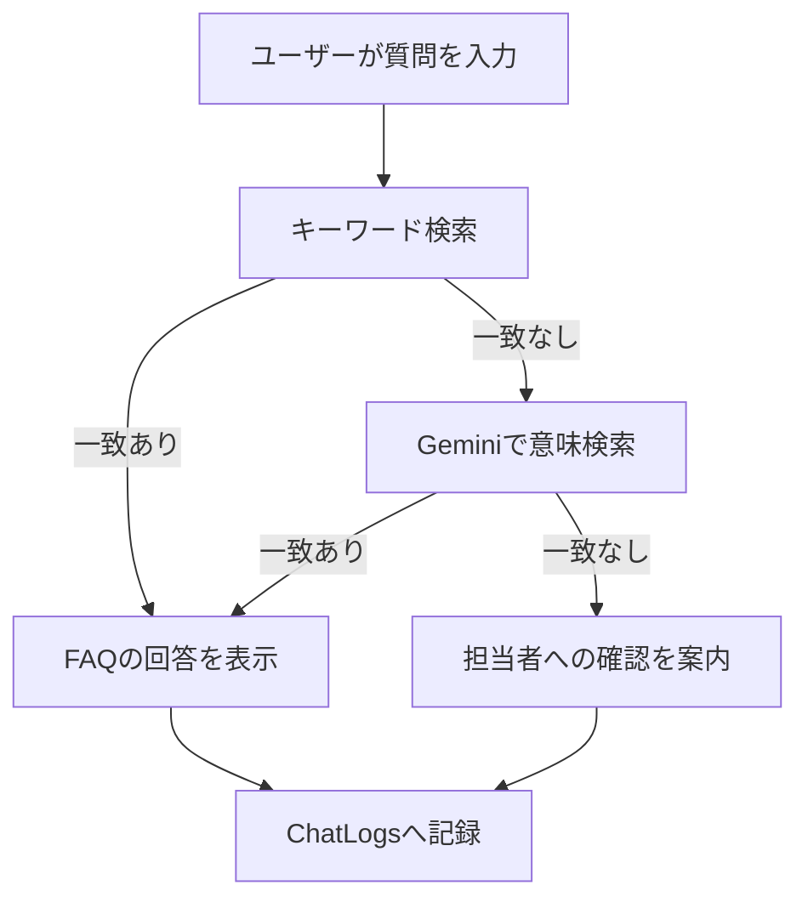
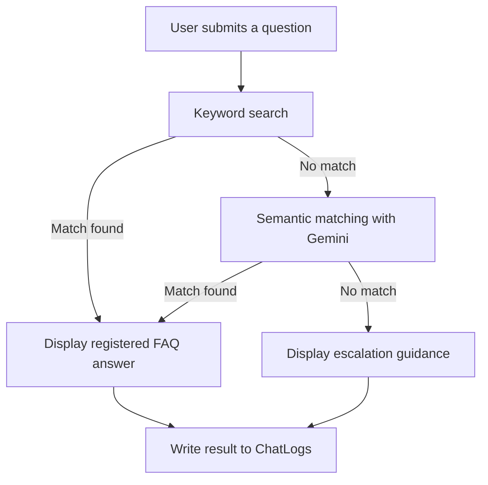

# 製造現場向けFAQチャットボット  
# Manufacturing FAQ Chatbot

Google Apps Script、Googleスプレッドシート、Gemini APIを利用した、製造現場向けFAQチャットボットです。

A manufacturing support FAQ chatbot built with Google Apps Script, Google Sheets, and the Gemini API.

- [日本語](#日本語)
- [English](#english)

---

# 日本語

## 1. 概要

製造現場で発生する設備、品質、部品、作業手順などの問い合わせに対し、Googleスプレッドシートに登録されたFAQから回答候補を提示するWebアプリケーションです。

通常は質問文と検索キーワードを比較し、対応するFAQを検索します。

キーワード検索でFAQを特定できない場合は、Gemini APIを使用して、ユーザーの質問とFAQの意味的な一致を判定します。

## 2. 開発背景

製造現場では、次のような課題が発生することがあります。

- 同じ問い合わせへの繰り返し対応
- 担当者による回答内容のばらつき
- 必要なFAQを検索するための言葉が分からない
- 問い合わせ内容や対応結果が記録されない
- FAQに不足している情報を把握しにくい

これらの課題に対し、FAQの一元管理、自然な言い回しへの対応、問い合わせ履歴の記録を行うことを目的として開発しました。

## 3. 主な機能

- GoogleスプレッドシートによるFAQ管理
- 質問文と検索キーワードによるFAQ検索
- Gemini APIを利用した意味検索
- FAQに存在しない質問への未解決案内
- 質問、回答、参照FAQ ID、回答結果のログ保存
- パソコンおよびスマートフォン対応のチャット画面
- APIキーのスクリプトプロパティ管理
- 連続送信の防止
- 日本語入力中のEnterキー誤送信防止

## 4. 処理の流れ



## 5. AI利用時の安全対策

Geminiには回答文を自由生成させず、質問に対応するFAQ IDの選択だけを行わせています。

実際にユーザーへ表示する回答は、管理者がGoogleスプレッドシートへ登録した内容です。

これにより、FAQに存在しない作業手順や危険な操作をAIが生成するリスクを抑えています。

また、Geminiが返したFAQ IDがスプレッドシート内に実在するかを確認し、存在しない場合は回答として採用しません。

## 6. 使用技術

- Google Apps Script
- JavaScript
- HTML
- CSS
- Googleスプレッドシート
- Gemini API
- Gemini 3.1 Flash-Lite

## 7. ファイル構成

```text
manufacturing-faq-chatbot-gas
├── README.md
└── src
    ├── Code.gs
    └── Index.html
```

### Code.gs

次のサーバー側処理を担当します。

- FAQデータの取得
- キーワード検索
- Gemini APIとの通信
- 未解決メッセージの取得
- ChatLogsシートへの記録
- Webアプリ画面の表示

### Index.html

次の画面側処理を担当します。

- チャット画面の表示
- 質問の送信
- 回答および参照FAQ IDの表示
- 検索中の連続送信防止
- エラー表示
- スマートフォン向けレイアウト

## 8. スプレッドシート構成

### FAQシート

| 列 | 項目 | 説明 |
|---|---|---|
| A | FAQ_ID | FAQを識別する一意のID |
| B | カテゴリ | 設備、品質、部品などの分類 |
| C | 質問 | FAQとして登録する質問 |
| D | 回答 | ユーザーへ表示する回答 |
| E | 検索キーワード | キーワード検索に使用する語句 |

### ChatLogsシート

| 列 | 項目 | 説明 |
|---|---|---|
| A | 記録日時 | 質問を受け付けた日時 |
| B | 質問 | ユーザーが入力した質問 |
| C | 回答 | チャットボットが表示した回答 |
| D | 参照FAQ_ID | 回答時に参照したFAQ ID |
| E | 回答結果 | キーワード検索、Gemini、未解決の区分 |

### Settingsシート

| 列 | 項目 | 説明 |
|---|---|---|
| A | 設定項目 | 設定の名称 |
| B | 設定値 | 設定内容 |

## 9. セットアップ方法

1. Googleスプレッドシートを作成します。
2. `FAQ`、`ChatLogs`、`Settings`シートを作成します。
3. スプレッドシートからGoogle Apps Scriptを開きます。
4. `src/Code.gs`の内容をApps Scriptのコードファイルへ貼り付けます。
5. `src/Index.html`の内容をHTMLファイルへ貼り付けます。
6. Google AI StudioでGemini APIキーを作成します。
7. Apps ScriptのスクリプトプロパティへAPIキーを登録します。
8. Webアプリとしてデプロイします。

スクリプトプロパティには、次の名前でAPIキーを登録します。

```text
プロパティ名: GEMINI_API_KEY
値: 取得したGemini APIキー
```

## 10. セキュリティ

Gemini APIキーはソースコードへ直接記載せず、Google Apps Scriptのスクリプトプロパティで管理しています。

このリポジトリには、次の情報を含めていません。

- Gemini APIキー
- Googleアカウント情報
- スプレッドシートID
- WebアプリのデプロイID
- 実在する企業や顧客の情報
- 個人情報

## 11. テスト例

| 入力 | 期待結果 |
|---|---|
| 装置の電源が入りません | キーワード検索でFAQ-001を表示 |
| スイッチを押しても装置にまったく通電していないようです | Geminiの意味検索でFAQ-001を表示 |
| 社員食堂は何時からですか | 未解決メッセージを表示 |
| 空欄 | 質問を送信しない |
| 日本語変換中のEnterキー | 質問を送信しない |

## 12. 今後の改善案

- FAQの登録・編集画面
- カテゴリによる検索対象の絞り込み
- 未解決質問の集計
- FAQ追加候補の自動抽出
- 管理者向けダッシュボード
- API利用回数の制限
- 回答に対する「解決した・解決しなかった」の評価機能
- ユーザー認証と権限管理
- 自動テストの追加

## 13. 補足

本アプリケーションは、個人学習およびポートフォリオを目的として作成したサンプルです。

掲載しているFAQ、企業、設備、問い合わせ内容はすべて架空のものです。

---

# English

## 1. Overview

This is a web-based FAQ chatbot for manufacturing support.

It provides answers to questions about equipment, quality, parts, work procedures, and other manufacturing-related topics by searching FAQ records stored in Google Sheets.

The application first performs a keyword-based search. If no FAQ is found, it uses the Gemini API to determine which registered FAQ is semantically closest to the user's question.

## 2. Background

Manufacturing support operations may face the following challenges:

- Repeated responses to the same questions
- Inconsistent answers depending on the person in charge
- Difficulty finding the correct FAQ search terms
- Lack of inquiry and response history
- Difficulty identifying missing FAQ information

This application was developed to centralize FAQ management, support natural-language questions, and record inquiry history.

## 3. Features

- FAQ management using Google Sheets
- Keyword-based FAQ search
- Semantic FAQ matching using the Gemini API
- Fallback guidance for unresolved questions
- Logging of questions, answers, FAQ IDs, and result types
- Responsive desktop and mobile chat interface
- Secure API key management using Script Properties
- Prevention of duplicate requests
- Prevention of accidental submission during Japanese IME composition

## 4. Processing Flow



## 5. AI Safety Design

Gemini does not freely generate the final answer.

It is only used to select the FAQ ID that best matches the user's question. The actual answer displayed to the user is retrieved from the trusted FAQ data stored in Google Sheets.

This design reduces the risk of the AI generating unsupported procedures or potentially unsafe instructions.

The application also verifies that the FAQ ID returned by Gemini exists in the spreadsheet before using it.

## 6. Technologies

- Google Apps Script
- JavaScript
- HTML
- CSS
- Google Sheets
- Gemini API
- Gemini 3.1 Flash-Lite

## 7. Project Structure

```text
manufacturing-faq-chatbot-gas
├── README.md
└── src
    ├── Code.gs
    └── Index.html
```

### Code.gs

Responsible for:

- Retrieving FAQ data
- Keyword matching
- Gemini API communication
- Retrieving the fallback message
- Writing inquiry logs
- Serving the web application

### Index.html

Responsible for:

- Displaying the chatbot interface
- Submitting questions
- Displaying answers and referenced FAQ IDs
- Preventing duplicate requests
- Displaying errors
- Providing a responsive mobile layout

## 8. Spreadsheet Structure

### FAQ Sheet

| Column | Field | Description |
|---|---|---|
| A | FAQ_ID | Unique FAQ identifier |
| B | Category | Equipment, quality, parts, and other categories |
| C | Question | Registered FAQ question |
| D | Answer | Answer displayed to the user |
| E | Search Keywords | Keywords used for matching |

### ChatLogs Sheet

| Column | Field | Description |
|---|---|---|
| A | Timestamp | Date and time of the inquiry |
| B | Question | Question submitted by the user |
| C | Answer | Answer displayed by the chatbot |
| D | Referenced FAQ ID | FAQ ID used for the answer |
| E | Result Type | Keyword match, Gemini match, or unresolved |

### Settings Sheet

| Column | Field | Description |
|---|---|---|
| A | Setting Name | Name of the setting |
| B | Setting Value | Value of the setting |

## 9. Setup

1. Create a Google Spreadsheet.
2. Create the `FAQ`, `ChatLogs`, and `Settings` sheets.
3. Open Google Apps Script from the spreadsheet.
4. Copy `src/Code.gs` into the Apps Script code file.
5. Copy `src/Index.html` into an HTML file.
6. Create a Gemini API key in Google AI Studio.
7. Store the API key in Apps Script Properties.
8. Deploy the project as a web application.

Register the API key using the following Script Property:

```text
Property name: GEMINI_API_KEY
Value: Your Gemini API key
```

## 10. Security

The Gemini API key is not stored directly in the source code. It is managed through Google Apps Script Properties.

This repository does not contain:

- Gemini API keys
- Google account information
- Spreadsheet IDs
- Web application deployment IDs
- Real company or customer information
- Personal information

## 11. Test Cases

| Input | Expected Result |
|---|---|
| 装置の電源が入りません | Display FAQ-001 using keyword search |
| スイッチを押しても装置にまったく通電していないようです | Display FAQ-001 using Gemini semantic matching |
| 社員食堂は何時からですか | Display the unresolved-question message |
| Empty input | Do not submit the question |
| Enter during IME composition | Do not submit the question |

## 12. Future Improvements

- FAQ administration interface
- Category-based filtering
- Unresolved-question analytics
- Automatic FAQ candidate extraction
- Administrator dashboard
- API usage limits
- Resolved/unresolved feedback
- User authentication and authorization
- Automated tests

## 13. Disclaimer

This application was created for personal learning and portfolio purposes.

All FAQ data, companies, equipment, and inquiry examples used in this project are fictional.
